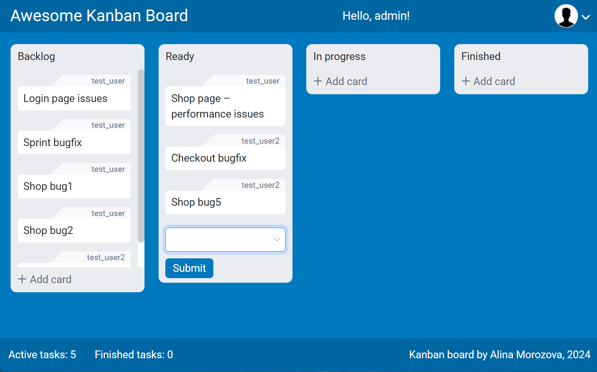

# Kanban board

Kanban-доска с возможностью добавлять, удалять и редактировать задачи (Tasks). Пользователь может иметь роль администратора с возможностью добавлять и удалять обычных пользователей.
Исходник: https://github.com/ledvanoff/sf_oopapp (Oleg Ledvanov).
Сделан в качестве учебного проекта Skillfactory.

### Доступы

- "test_user", "123"
- "admin", "123"

### Инструменты

- Node.js, webpack
- HTML5, CSS, Bootstrap 5

### Как запустить dev-версию

- скачать архив с проектом, распаковать
- установить Node.js, npm, webpack и другие модули (команда 'npm -i'). Обновить зависимости
- запуск: команда 'npm run start'